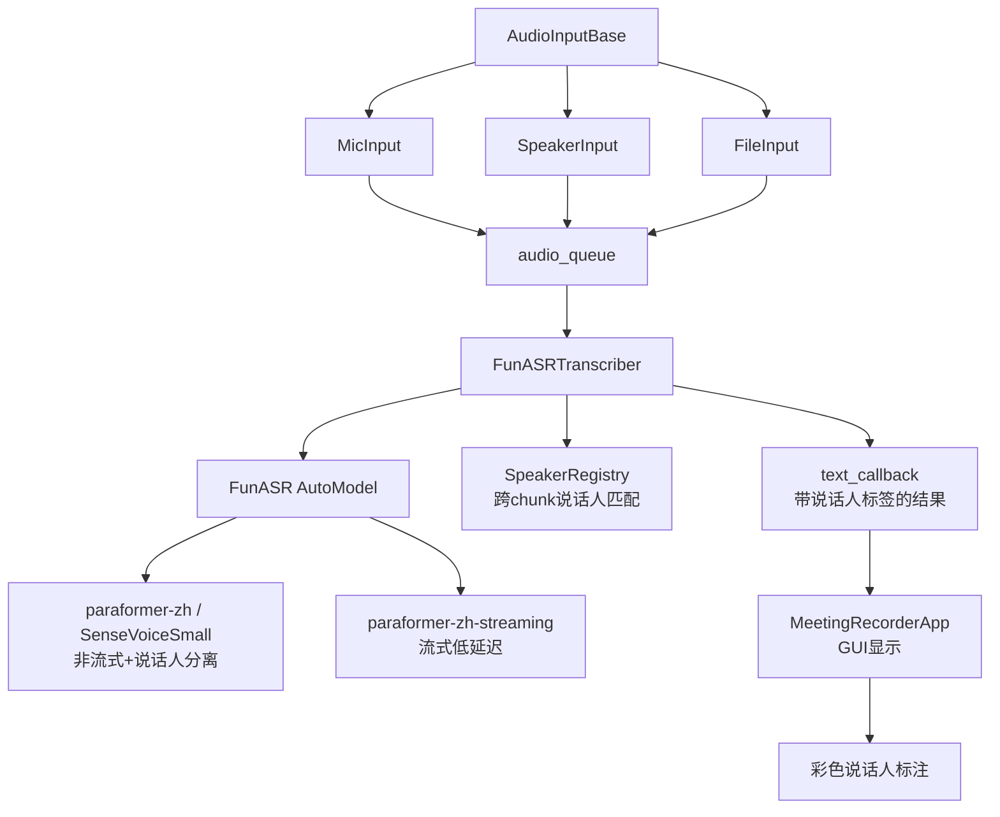

## Product Overview

将现有的 Meeting Live Caption 应用从 faster-whisper + pyannote 方案迁移到 FunASR，实现实时语音识别（ASR）与说话人分离（Speaker Diarization），并支持麦克风、扬声器（WASAPI环路）、音频文件三种输入源。

## Core Features

- **三种输入源**：麦克风实时采集、扬声器WASAPI环路采集、本地音频文件（WAV/MP3/MP4）
- **FunASR语音识别**：支持非流式（带说话人分离）和流式（低延迟）两种模式，可选模型包括 paraformer-zh、SenseVoiceSmall、paraformer-zh-streaming、Fun-ASR-Nano
- **说话人分离**：集成 cam++ 模型，自动识别说话人并标注，跨chunk维护说话人一致性
- **说话人色彩标注**：转录文本按说话人用不同颜色显示
- **GUI更新**：输入源选择器、文件路径选择、FunASR模型选择、说话人分离开关、设备选择
- **配置持久化**：保存/加载FunASR相关设置到config.json

## Tech Stack

- **ASR引擎**: FunASR (`funasr` Python包)，AutoModel API
- **音频采集**: pyaudiowpatch (WASAPI环路) / pyaudio (麦克风)
- **文件读取**: soundfile (WAV) + ffmpeg subprocess (MP3/MP4)
- **GUI**: tkinter (保持现有方案)
- **音频处理**: numpy
- **关键点提取**: Ollama (保持现有方案)

## Implementation Approach

采用模块化重构策略，将现有的单体 `main.py` 拆分为三个核心模块：`audio_input.py`（统一音频输入）、`asr_engine.py`（FunASR引擎+说话人分离）、`main.py`（GUI集成）。

**核心设计决策**：

1. **非流式+说话人分离作为默认模式**：每3-5秒积累一个音频chunk，使用 `paraformer-zh` + `fsmn-vad` + `ct-punc` + `cam++` 完整管线处理，同时获得转录文本和说话人标签。延迟约3-5秒，对会议场景可接受。
2. **流式模式作为可选低延迟模式**：使用 `paraformer-zh-streaming` 实现近实时转录（600ms粒度），但不支持说话人分离。
3. **跨chunk说话人一致性**：维护说话人嵌入向量注册表，新chunk的说话人嵌入与已有注册表比对余弦相似度，超过阈值则匹配同一说话人，否则注册新说话人。
4. **文件输入**：非实时模式直接处理整个文件获得最佳说话人分离效果；也可模拟流式逐chunk处理。

**性能考虑**：

- FunASR非流式模型处理5秒音频chunk约需0.5-2秒（CPU），延迟可控
- 说话人嵌入比对开销极小（纯向量运算）
- cam++模型仅7.2M参数，推理速度快
- 流式模式延迟约600ms，适合需要近实时反馈的场景

## Architecture Design



## Directory Structure

```
c:\Test\captions\meeting-live-caption\
├── audio_input.py                # [NEW] 统一音频输入模块
│   ├── AudioInputBase            # 抽象基类: audio_queue, start/stop, WAV保存
│   ├── MicInput                  # 麦克风输入: pyaudio标准采集
│   ├── SpeakerInput              # 扬声器输入: WASAPI环路采集(基于现有AudioRecorder)
│   └── FileInput                 # 文件输入: soundfile/ffmpeg读取, 模拟流式
│
├── asr_engine.py                 # [NEW] FunASR ASR引擎+说话人分离
│   ├── FunASRTranscriber         # 主转录器: 从队列读取音频, 运行ASR, 输出结果
│   ├── SpeakerRegistry           # 说话人注册表: 嵌入向量存储+余弦相似度匹配
│   └── TranscriptionResult       # 结果数据类: text, speaker, start, end, is_final
│
├── app.py                        # [NEW] 新入口文件，FunASR版GUI
│   ├── MeetingCaptionApp         # 全新GUI应用类
│   ├── 新增 输入源选择器          # Mic/Speaker/File 三选一
│   ├── 新增 文件路径选择          # 文件输入时显示
│   ├── FunASR模型选择器           # paraformer-zh/SenseVoice/streaming/Nano
│   ├── 说话人分离开关             # 启用/禁用spk_model
│   ├── 说话人颜色标注             # 不同说话人不同颜色
│   ├── 配置保存/加载              # FunASR相关设置
│   └── KeyPointExtractor保留     # Ollama关键点提取
│
├── main.py                       # [KEEP] 保留原faster-whisper版本不动
├── asr.py                        # [MODIFY] 使用FunASR替代faster-whisper
├── asr_speaker_diarization.py    # [MODIFY] 使用FunASR+cam++替代pyannote
├── config.json                   # [MODIFY] 新增FunASR配置字段
├── README.md                     # [MODIFY] 更新文档
├── TECHNICAL_DOCS.md             # [MODIFY] 更新技术文档
└── USAGE.md                      # [MODIFY] 更新使用指南
```

## Key Code Structures

```python
# audio_input.py - 音频输入基类与实现
class AudioInputBase(ABC):
    audio_queue: queue.Queue        # 输出: 16kHz mono int16 numpy数组
    sample_rate: int = 16000
    is_recording: bool
    def start(self, records_folder: str): ...
    def stop(self): ...
    def get_base_filename(self) -> str: ...
    def get_wav_path(self) -> str: ...

class MicInput(AudioInputBase):
    def __init__(self, device_index: int, sample_rate=16000, chunk_duration=3.0, save_audio=True): ...

class SpeakerInput(AudioInputBase):
    def __init__(self, device_index: int, sample_rate=16000, chunk_duration=3.0, save_audio=True): ...

class FileInput(AudioInputBase):
    def __init__(self, file_path: str, sample_rate=16000, chunk_duration=5.0, simulate_realtime=True): ...
```

```python
# asr_engine.py - FunASR引擎与说话人管理
class TranscriptionResult:
    text: str
    speaker: Optional[str]         # "SPEAKER_0", "SPEAKER_1", ...
    start_ms: int
    end_ms: int
    is_final: bool

class SpeakerRegistry:
    speakers: Dict[str, np.ndarray]  # speaker_id -> embedding vector
    def match_or_register(self, embedding: np.ndarray, threshold: float = 0.7) -> str: ...

class FunASRTranscriber:
    def __init__(self, audio_input: AudioInputBase, model_name: str, 
                 streaming: bool, language: str, enable_diarization: bool,
                 device: str, records_folder: str): ...
    def set_text_callback(self, callback: Callable[[TranscriptionResult], None]): ...
    def start(self): ...
    def stop(self): ...
```

## Implementation Notes

- **FunASR版本**: 需要 funasr >= 1.0.2（修复了cam++ GPU/CPU张量转换问题）
- **跨chunk说话人一致性**: SpeakerRegistry 使用 cam++ 提取的嵌入向量，通过余弦相似度匹配。设置0.7为默认阈值，可在配置中调整。
- **文件输入**: 对MP3/MP4文件先调用ffmpeg转为临时WAV，处理完毕后清理临时文件。
- **WAV保存**: 保持现有的独立写入线程模式，三种输入源都支持音频保存。
- **GUI线程安全**: 保持现有的 _pending_lock + root.after 刷新模式，确保文本更新在主线程执行。
- **向后兼容**: config.json 加载时对缺失的FunASR字段使用默认值，不影响旧配置文件。
- **颜色方案**: 为最多8个说话人预定义颜色标签，使用tkinter Text tag实现彩色标注。

## 设计方案

基于现有tkinter桌面应用进行UI重构，保持桌面应用风格，新增输入源选择和说话人标注功能。

### 页面布局（单窗口）

从上到下分为以下区块：

**1. 输入源与设备选择区**

- 输入模式：Mic / Speaker / File 三选一 (Radiobutton)
- 设备下拉框：Mic/Speaker模式下列出可用音频设备
- 文件路径：File模式下显示路径输入框+浏览按钮
- 刷新设备按钮

**2. ASR引擎配置区**

- FunASR模型选择：paraformer-zh / SenseVoiceSmall / paraformer-zh-streaming / Fun-ASR-Nano
- 语言选择：根据模型自动调整可选项
- 说话人分离开关（仅非流式模型可用）
- 运行设备：CPU / CUDA

**3. 保存与选项区**

- 保存音频和文本复选框
- 文件状态标签
- 打开记录文件夹按钮

**4. 关键点提取配置区**（保持现有Ollama配置）

**5. 操作按钮区**

- 开始录制 / 停止录制 / 清除文本 / 暗色模式

**6. 状态栏**

**7. 输出区**

- 左侧：实时转录（带说话人颜色标注，格式：`[说话人0] 转录文本`）
- 右侧：关键点摘要

### 说话人颜色标注

转录文本中每个说话人用不同颜色显示，格式为 `[SPEAKER 0] 转录内容`，颜色方案：

- SPEAKER 0: #2196F3 (蓝)
- SPEAKER 1: #4CAF50 (绿)
- SPEAKER 2: #FF9800 (橙)
- SPEAKER 3: #F44336 (红)
- SPEAKER 4: #9C27B0 (紫)
- SPEAKER 5: #00BCD4 (青)
- SPEAKER 6: #795548 (棕)
- SPEAKER 7: #607D8B (灰蓝)

## SubAgent

- **code-explorer**: 在实现阶段搜索项目中特定的导入关系、函数调用链和配置字段引用，确保重构时没有遗漏的依赖