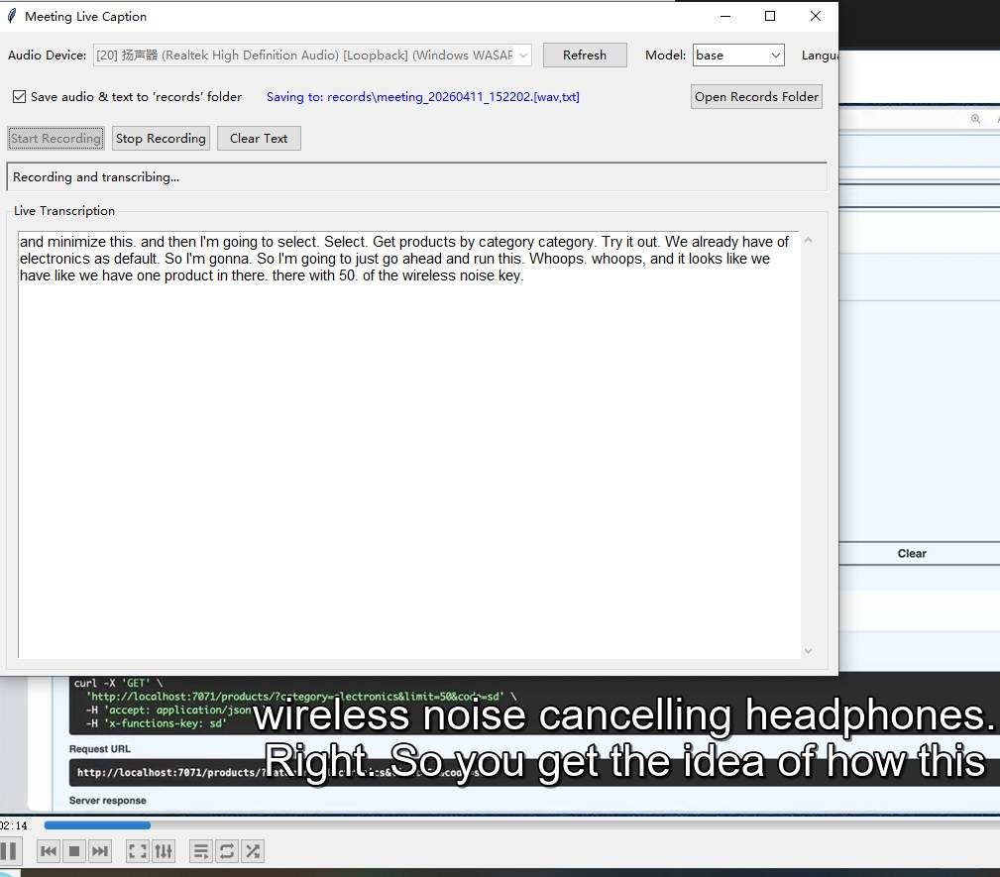

# Meeting Live Caption

Real-time Meeting Audio and Text Recorder. This application records system audio, transcribes it, and saves both audio (WAV) and transcription (TXT), such as Teams or Zoom.



## Features

- Real-time audio recording
- Live speech-to-text transcription
- Simultaneous saving of audio (WAV) and text (TXT) files
- Brief key-point extraction from live captions using Ollama
- Support for multiple Whisper models and languages
- Speaker Diarization (TODO)

## Requirements

- Python 3.7+
- Windows OS (for WASAPI loopback support)
- Required packages (install with pip):
  - `faster-whisper`
  - `pyaudiowpatch`
  - `numpy`
  - `tkinter` (usually comes with Python)

Optional for key-point extraction:
- [Ollama](https://ollama.com/) running locally or remotely
- A pulled model (example: `ollama pull llama3.1:8b`)

## Installation

1. Clone or download this repository
2. Install required dependencies:
   ```bash
   pip install faster-whisper pyaudiowpatch numpy
   ```
3. Run the application:
   ```bash
   python main.py
   ```

## Usage

1. Launch the application (`python main.py`)
2. Select your audio device from the dropdown (usually the current playback device)
3. Choose the Whisper model size (tiny, base, small, medium, large-v2, large-v3)
4. Select the transcription language (en, zh, es, fr, de, ja, ko, auto)
5. Toggle whether to save audio and text files
6. Configure key-point extraction:
   - Enable checkbox
   - Ollama URL (example: `http://localhost:11434`)
   - Model name (example: `llama3.1:8b`)
   - Refresh interval in seconds
   - Prompt used to extract key points
7. Click "Start Recording" to begin live captioning
8. View live transcription and periodic brief key points
9. Click "Stop Recording" when finished
10. Find your saved files in the 'records' folder

## Configuration Options

- **Audio Device**: Select which playback device to record from
- **Model Size**: Choose between tiny, base, small, medium, or large Whisper models
- **Language**: Specify the language for transcription or use "auto" for automatic detection
- **Save Files**: Option to save both audio and text files to the 'records' folder
- **Ollama URL**: API endpoint for key-point extraction requests
- **Ollama Model**: Model used to summarize live captions
- **Extraction Prompt**: Custom instruction prompt for key-point style
- **Refresh Interval**: How often key points are regenerated from recent captions

## File Structure

After recording, the application creates files in the 'records' folder with the following naming convention:
- `meeting_YYYYMMDD_HHMMSS.wav` - Audio recording
- `meeting_YYYYMMDD_HHMMSS.txt` - Transcription text

## How It Works

The application consists of three main components:

1. **AudioRecorder**: Handles WASAPI loopback recording, pushes audio chunks to a queue, and saves to WAV format
2. **Transcriber**: Processes audio chunks from the queue, performs Whisper transcription, and saves text
3. **MeetingRecorderApp**: Provides the GUI interface and manages the recording/transcription workflow

The system uses a threaded approach where audio recording happens in one thread, transcription in another, and the GUI updates in the main thread.

## Performance Notes

- The application uses CPU-based inference for Whisper transcription
- Different model sizes offer trade-offs between speed and accuracy
- The "base" model is typically a good balance of speed and quality
- Larger models may take more processing power and time

## Troubleshooting

- If no audio devices appear, make sure your system has WASAPI-compatible audio devices
- If transcription is slow, try using smaller Whisper models
- Ensure you have sufficient disk space for audio recordings
- On Windows, you may need to allow the application to access microphone permissions

## Acknowledgments
- DeepSeek for vibe coding

## License

This project is open-source. See the LICENSE file for details.